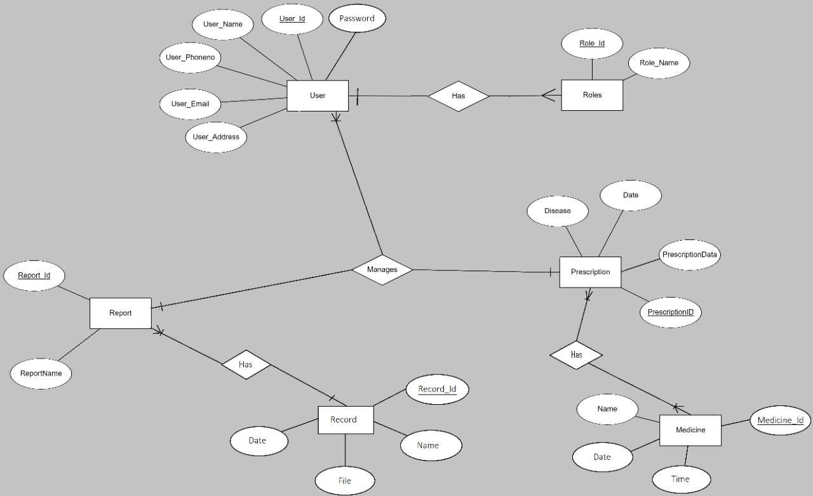
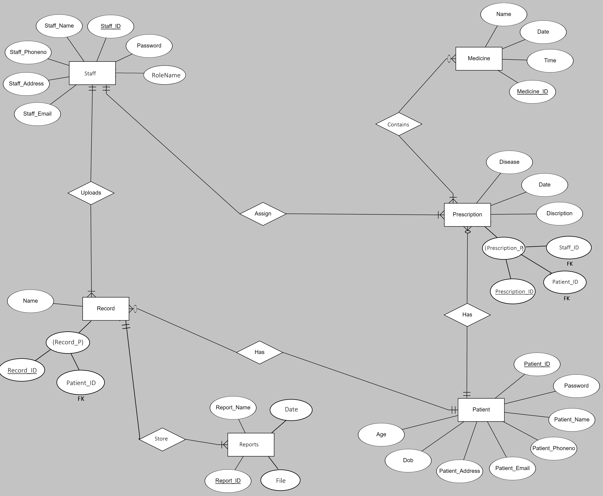

CS1106 Project

**Table of Content**

- [Description](#description)
- [ER Model](#er-model)
  - [Proposed ER Models](#proposed-er-models)
  - [Final ER Model](#final-er-model)
- [Relational Schema](#relational-schema)
  - [Final Schema](#final-schema)
- [Design](#design)
  - [Design](#design-1)
- [Tech Stack](#tech-stack)
- [MySQL](#mysql)
- [Database Creation](#database-creation)
- [Table Creation](#table-creation)

  

## Description

In this era when most commercial transactions are automated for reasons of efficiency and accuracy, it is somewhat ironic that most recording of medical events is still done on paper. Despite a wealth of evidence that the electronic medical record(EMR) can save time and cost as well as lead to improved clinical outcomes and data security, most patient-related information is still recorded manually. 

So the Basic idea for this project is to create an online platform where one can see and access all of his/her medical records at a single place and can also be accessed by Doctor and Medical Staff.

The Platform will have:

- Login Funcationality. 
- Pill Tracker on daily basis.
- Medicine Update Funcationality.
- Database Connectivity.
- Forgot Password Functionality.
- Searching Functionality.

## ER Model

### Proposed ER Models

### Final ER Model

## Relational Schema

### Final Schema

## Design

### Design

## Tech Stack

| Technology        | Used for |
| ----------------- | -------- |
| ReactJS           | Frontend |
| NodeJS, ExpressJS | Backend  |
| MySQL             | Database |
| AWS               | Hosting  |
| ReactBootstrap    | Frontend |

## MySQL

## Database Creation

## Table Creation

