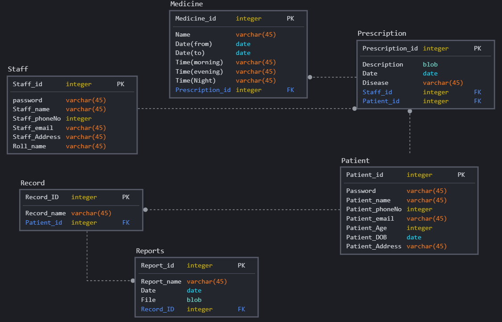

CS1106 Project

**Table of Content**

- [Description](#description)
- [ER Model](#er-model)
  - [Proposed ER Models](#proposed-er-models)
  - [Final ER Model](#final-er-model)
- [Relational Schema](#relational-schema)
  - [Final Schema](#final-schema)
- [Design](#design)
  - [Design](#design-1)
- [Tech Stack](#tech-stack)
- [MySQL](#mysql)
  - [Create a New User](#create-a-new-user)
  - [Grant Different User Permissions](#grant-different-user-permissions)
  - [Table Creation](#table-creation)
    - [Staff](#staff)
    - [Patient](#patient)
    - [Record](#record)
    - [Report](#report)
    - [Prescription](#prescription)
    - [Medicine](#medicine)

## Description

In this era when most commercial transactions are automated for reasons of efficiency and accuracy, it is somewhat ironic that most recording of medical events is still done on paper. Despite a wealth of evidence that the electronic medical record(EMR) can save time and cost as well as lead to improved clinical outcomes and data security, most patient-related information is still recorded manually.

So the Basic idea for this project is to create an online platform where one can see and access all of his/her medical records at a single place and can also be accessed by Doctor and Medical Staff.

The Platform will have:

- Login Funcationality.
- Pill Tracker on daily basis.
- Medicine Update Funcationality.
- Database Connectivity.
- Forgot Password Functionality.
- Searching Functionality.

## ER Model

### Proposed ER Models


### Final ER Model


## Relational Schema

### Final Schema



## Design

### Design


## Tech Stack

| Technology        | Used for |
| ----------------- | -------- |
| ReactJS           | Frontend |
| NodeJS, ExpressJS | Backend  |
| MySQL             | Database |
| AWS               | Hosting  |
| ReactBootstrap    | Frontend |

## MySQL

### Create a New User

Login as `root` user.

Create a New user using the following command:

```sql
CREATE USER 'newuser'@'localhost' IDENTIFIED BY 'password';
```

At this point, `newuser` has no permissions to do anything with the databases. In fact, even if `newuser` tries to login (with the password, `password`), they will not be able to reach the MySQL shell.

Therefore, the first thing to do is to provide the user with access to the information they will need.

```sql
GRANT ALL PRIVILEGES ON *.* TO 'newuser'@'localhost';
```

The asterisks in this command refer to the database and table (respectively) that they can access—this specific command allows the user to read, edit, execute and perform all tasks across all the databases and tables.

Please note that in this example we are granting `newuser` full root access to everything in our database. While this is helpful for explaining some MySQL concepts, it may be impractical for most use cases and could put your database’s security at high risk.

Once you have finalized the permissions that you want to set up for your new users, always be sure to reload all the privileges.

```sql
FLUSH PRIVILEGES;
```

Your changes will now be in effect.

### Grant Different User Permissions

Here is a short list of other common possible permissions that users can enjoy.

- ALL PRIVILEGES- as we saw previously, this would allow a MySQL user full access to a designated database (or if no database is selected, global access across the system)
- CREATE- allows them to create new tables or databases
- DROP- allows them to them to delete tables or databases
- DELETE- allows them to delete rows from tables
- INSERT- allows them to insert rows into tables
- SELECT- allows them to use the `SELECT` command to read through databases
- UPDATE- allow them to update table rows
- GRANT OPTION- allows them to grant or remove other users’ privileges

To provide a specific user with a permission, you can use this framework:

```sql
GRANT type_of_permission ON database_name.table_name TO 'username'@'localhost';
```

If you want to give them access to any database or to any table, make sure to put an asterisk (\*) in the place of the database name or table name.

Each time you update or change a permission be sure to use the Flush Privileges command.

If you need to revoke a permission, the structure is almost identical to granting it:

```sql
REVOKE type_of_permission ON database_name.table_name FROM 'username'@'localhost';
```

Note that when revoking permissions, the syntax requires that you use `FROM`, instead of `TO` as we used when granting permissions.

You can review a user’s current permissions by running the following:

```sql
SHOW GRANTS FOR 'username'@'localhost';
```

Just as you can delete databases with DROP, you can use DROP to delete a user altogether:

```sql
DROP USER 'username'@'localhost';
```

To test out your new user, log out by typing:

```sql
quit
```

and log back in with this command in terminal:

```bash
mysql -u [username] -p
```

---

### Table Creation

#### Staff

```sql
CREATE TABLE Staff (
    staffId INTEGER UNSIGNED NOT NULL AUTO_INCREMENT,
    password VARCHAR(64) NOT NULL,
    staffName VARCHAR(20) NOT NULL,
    staffPhoneno INTEGER NOT NULL,
    staffEmail VARCHAR(20) NOT NULL,
    staffAddress VARCHAR(30)NOT NULL,
    rollName VARCHAR(20) NOT NULl,
    PRIMARY KEY(staffId)
   )AUTO_INCREMENT=1;
```

#### Patient

```sql
CREATE TABLE Patient(
    patientId INTEGER UNSIGNED NOT NULL AUTO_INCREMENT ,
    password VARCHAR(64) NOT NULL,
    patientName VARCHAR(20) NOT NULL,
    patientPhoneno VARCHAR(11) NOT NULL,
    patientEmail VARCHAR(50) NOT NULL,
    patientDob date NOT NULL,
    patientAddress Varchar(40) NOT NULL,
    PRIMARY KEY(patientId)
)AUTO_INCREMENT=1;


```

#### Record

```sql
CREATE TABLE Record(
    recordId INTEGER UNSIGNED NOT NULL AUTO_INCREMENT ,
    recordName VARCHAR(20) NOT NULL,
    PRIMARY KEY(recordId),
    patientId INTEGER UNSIGNED,
    FOREIGN KEY Record(patientId) REFERENCES emrsystem.Patient(patientId)
)AUTO_INCREMENT=1;
```

#### Report

```sql
CREATE TABLE Report(
    reportId INTEGER  UNSIGNED NOT NULL AUTO_INCREMENT ,
    reportName VARCHAR(20) NOT NULL,
    Date date NOT NULL,
    File BLOB NOT NULL ,
    PRIMARY KEY(reportId),
    recordId INTEGER UNSIGNED,
    FOREIGN KEY Report(recordId) REFERENCES emrsystem.Record(recordId)
)AUTO_INCREMENT=1;
```

#### Prescription

```sql
CREATE TABLE Prescription(
    prescriptionId INTEGER  UNSIGNED NOT NULL AUTO_INCREMENT,
    description BLOB NOT NULL,
    disease VARCHAR(40) NOT NULL,
    PRIMARY KEY(prescriptionId),
    staffId INTEGER UNSIGNED,
    patientId INTEGER UNSIGNED,
    FOREIGN KEY (staffId) REFERENCES emrsystem.staff(staffId),
    FOREIGN KEY (patientId) REFERENCES emrsystem.Patient(patientId)
)AUTO_INCREMENT=1;
```

#### Medicine

```sql
CREATE TABLE Medicine(
     medicineId INTEGER  UNSIGNED NOT NULL AUTO_INCREMENT,
    name  VARCHAR(20) NOT NULL,
    dateFrom date NOT NULL,
    dateTo date NOT NULL,
    timeMorning VARCHAR(20) NOT NULL,
    timeEvening VARCHAR(20) NOT NULL,
    timeNight VARCHAR(20) NOT NULL,
    PRIMARY KEY(medicineId),
    prescriptionId INTEGER UNSIGNED,
    FOREIGN KEY Medicine(prescriptionId) REFERENCES emrsystem.Prescription(prescriptionId)
)AUTO_INCREMENT=1;
```
