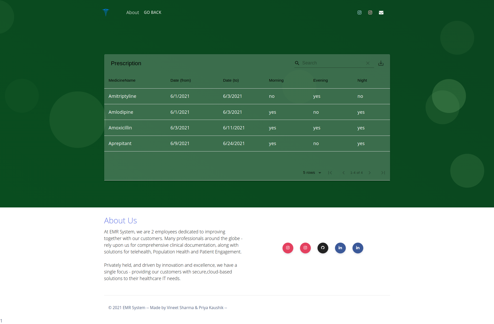
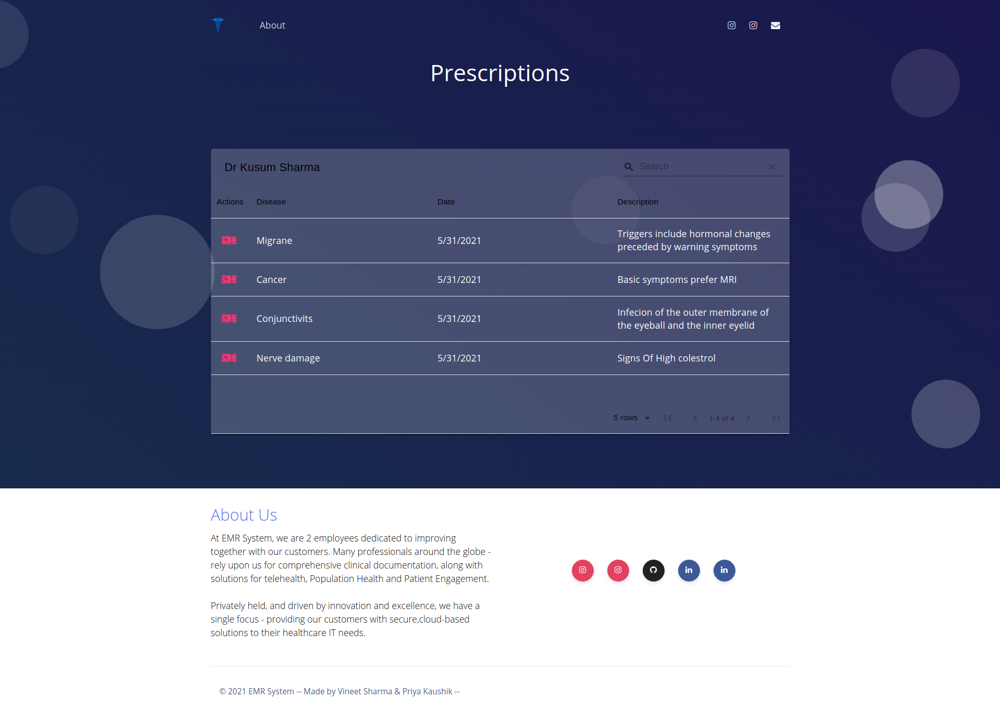
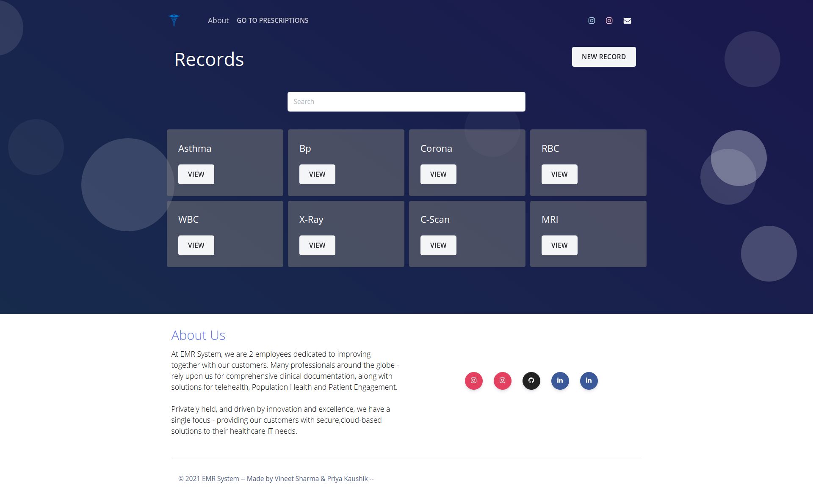
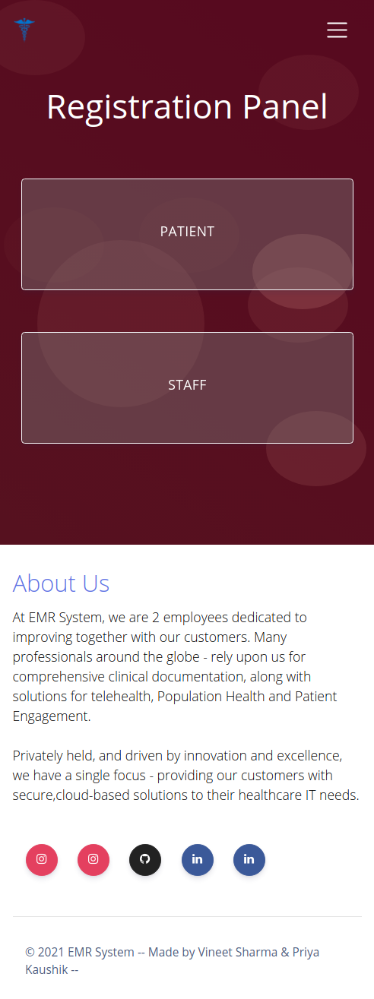
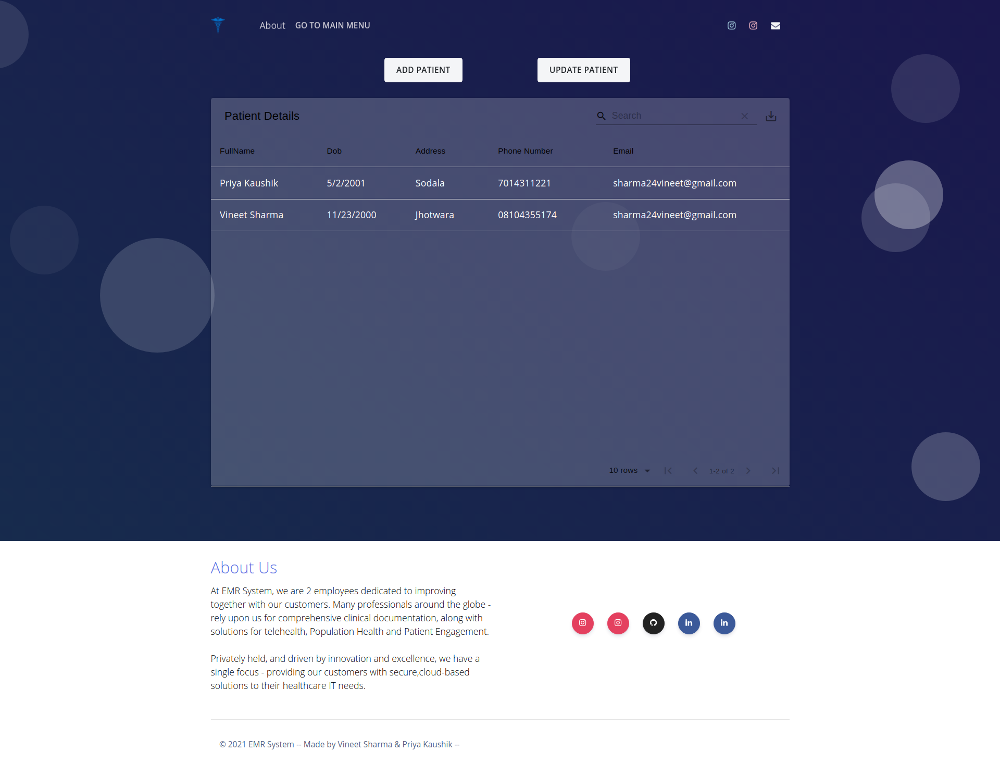
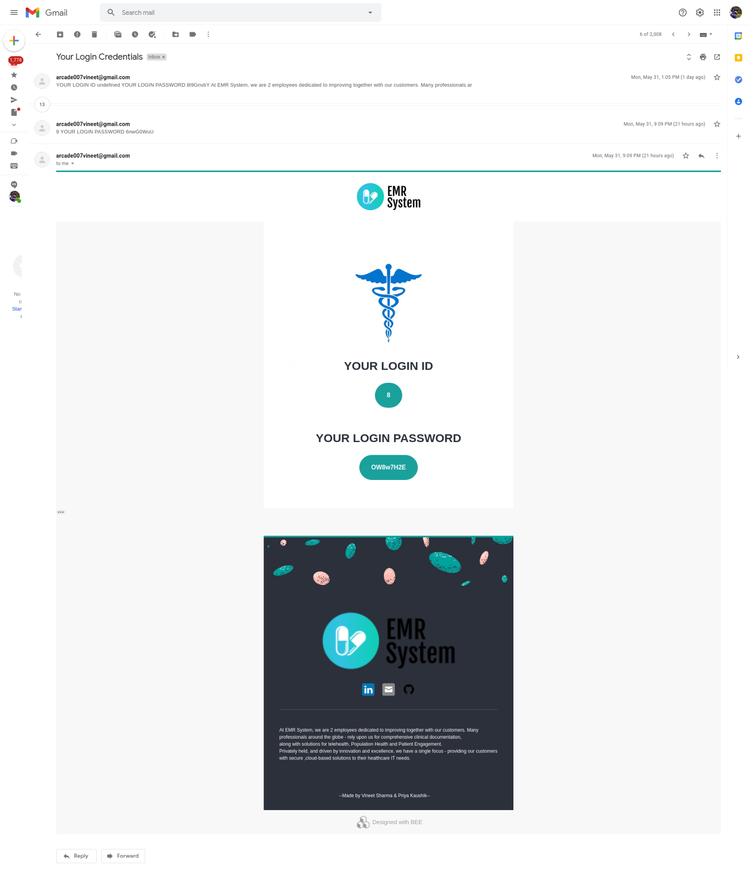

**1 Abstract**

In this era when most commercial transactions are automated for reasons of efficiency and accuracy, it is somewhat ironic that most recording of medical events is still done on paper. Despite a wealth of evidence that the electronic medical record(EMR) can save time and cost as well as lead to improved clinical outcomes and data security, most patient-related information is still recorded manually.

So the Basic idea for this project is to create an online platform where one can see and access all of his/her medical records at a single place and can also be accessed by Doctor and Medical Staff.

**Where must the system be placed?**

There are a lot of benefits to the Health center by placing the system at their registration and at drug store offices . At the same time the patients are also benefited using this system. They can get the work done within no time.

**How to use the system?**

Using the system is as simple as using the personal computer. Since end user computing is developing in our country, It is beneficial to both Health center and the patients. Every step is clearly defined and help is provided throughout the application to the user. Even the exceptions are handled well to avoid confusion.

**How is it beneficial to the Health Center?**

The health center can get much out of the system. The system is used to enter the patient details and to enter the details about the health center and the details about the in-patient and out-patient in detail and about the reports of the patients .

# 1.1 Functionalities

- ### Login Functionality

  Login authentication has been implemented which redirects users to their unrestricted set of pages or url after checking their correct password.

- ### Validation Form

  Validation has been implemented on every form and requires the correct set of data to click on the submit button.

- ### Validation on Tables

  Validation has been implemented on every table and requires the correct set of data to click on the submit button also have date restriction on date picker eg. while prescribing a medicine it allows only current date or later to be selected.

- ### Searching Functionality

  Searching has been added on all of the functional components and tables using react filter function.

- ### Password Hashing and Password Autogenerate

  SHA512 algorithm has been used through bcrypt to save passwords in a hashed form and autogenerate functionality has been added on first time registration.

- ### Export Functionality

  Export button has been implemented on every table to get data in pdf or csv form to store on the local machine.

- ### Complete Responsive Website (Support Mobile View)

  Every component of this project has been made with complete responsive functionality which allows this website to run smoothly on desktop as well as small screens including smartphones.

- ### Mailing Functionality

  After successful registration this application auto generates password and id for user and it uses mail functionality to provide those credentials through mail. Also the forgot password link is sent on mail using mailing functionality.

- ### Authentication and Cookies

  After successful login a unique authentication token is generated containing id and role and is stored in browser cookies for the set time duration which allows users to use different functionality on application and also restricts them to not access unauthorized components and functionalities.

- ### Logout Button
  Logout button has been set to the application logo which after clicking removes all the cookies of the user and restricts the application to run without login again.

**7 Conclusion**

The need for the Health Center to computerize the application processing and servicing the Patients request through automated modules is most necessary and now inevitable.

As we have already seen that the need cannot be emphasized for the further development of this system is only timely and helpful to Health Center, the system defined in the above script is up to date and caters to all kinds of request faced by the Health Center employees requirements to provide the better service to the patients, being developed in react it is also flexible modularized highly parameterized and hence can be easily deployed by any other application because of its componentized approach.

Based on the various parameters and properties files everything from the look and feel to the functionalities can be customized.Thus this project is developed from the beginning with reuse in mind and implicitly uses several design patterns. The architecture of this project is such that it suits the diverse and distributed nature of the Health Center Applications.

The features provided by the (Electronic Medical Record System) are in no means comprehensive but by all means fulfilling all important functionalities of Health Center services. Inclusion of further functionalities as days go by can be easily done because the project has been developed in a layered architecture.

External libraries would easily add new features which change with the times and being performance oriented the project will not face any issues. It is also extensible and scalable as all applications should be thus it can be said that it will meet surges of huge employee and patient requests that may come up in the near future.

**8 Project Screenshot**

### Login Page:

####

####

####

####

####

####

####

### Patient 1st page:

###

###

###

###

###

###

###

###

###

### Patient 2nd page: (View Button):

Patient 3rd Page: (Action button)

### Patient 3rd page:(View Records Button)

### Patient 4th page: (View Button)

### Staff 1st Page:

### Staff 2nd Page:

#### Responsive Design:

### Staff 3rd Page: (View Button)

#### Responsive Design:

` `

### Staff 4th Page: (Action Button after Adding)

### Staff 5th Page: (Other Doctor)

### Staff 6th Page:(View Records Button)

### Staff 7th Page:(View Button)

### Staff 8th Page:(Add Record Button)

### Registration Page:

#### Responsive Design:

#### ` `

### Patient Registration Page:

### Add Patient and Staff Page:

###

### Mail Template after creating new patient or staff:

Forgot Password Page:

### Forgot Password Link and Update Password Page :

